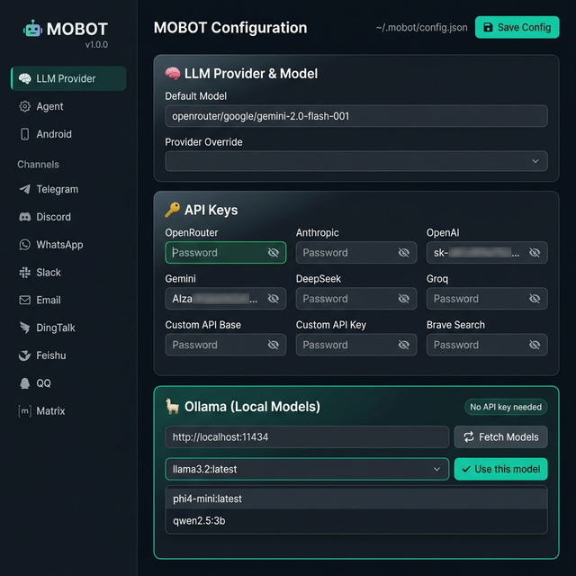
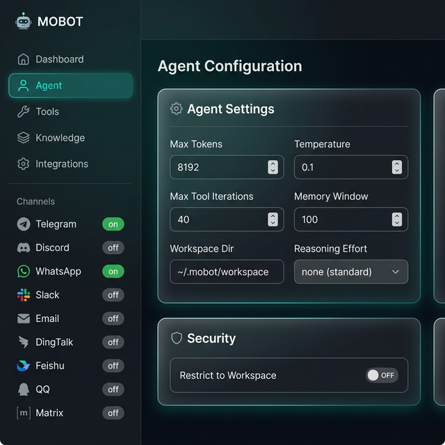
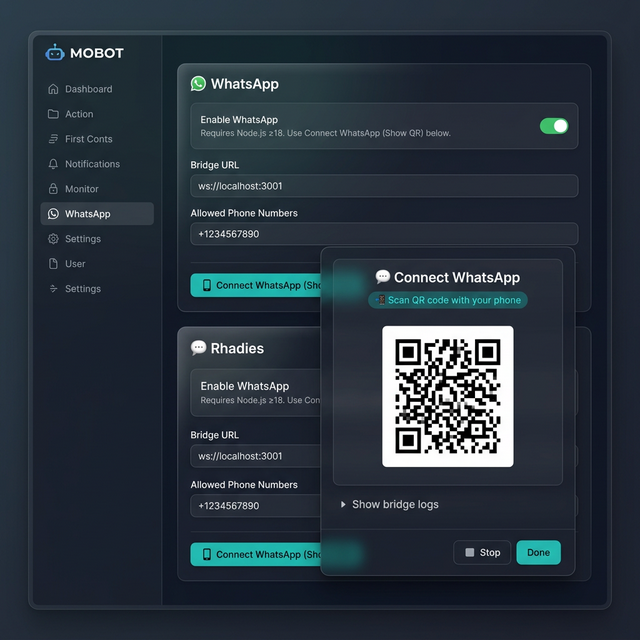

<div align="center">
  <h1>🤖 MOBOT — Android-Friendly AI Assistant</h1>
  <p>
    <a href="https://github.com/myaiartist360-maker/mobot"></a>
    
    
    
    
    
  </p>
  <p><em>Personal AI assistant for Android, Termux & PC — with a built-in browser-based setup UI</em></p>
</div>

---

**MOBOT** is an **Android-friendly personal AI assistant** forked from [NanoBot](https://github.com/HKUDS/nanobot). It runs directly on your Android device via **Termux**, can control your phone via ADB or Termux:API, and ships with a **beautiful web-based configuration UI** — no manual JSON editing needed.

⚡️ ~4,000 lines of core agent code · Multi-channel · MCP support · Runs on-device or on-PC

---

## ✨ What's New in MOBOT

| Feature | Description |
|---------|-------------|
| 🌐 **`mobot web`** | Browser-based config UI — easiest way to set up MOBOT |
| 📲 **WhatsApp QR in browser** | Scan WhatsApp QR code directly from the web UI |
| 🦙 **Ollama local models** | Pick and configure locally-running Ollama models, no API key needed |
| 📱 **Android control** | Tap, swipe, screenshot, launch apps — all via natural language |
| 🔌 **9 chat channels** | Telegram, Discord, WhatsApp, Slack, Email, DingTalk, Feishu, QQ, Matrix |

---

## 🌐 Web Configuration UI

Run `mobot web` to open a beautiful, mobile-friendly config dashboard in your browser.

```bash
mobot web          # → opens http://localhost:7891
mobot web --port 8080
mobot web --host 0.0.0.0   # expose on LAN (other devices on same Wi-Fi)
```

> **On Android / Termux**: run `mobot web`, then open `http://localhost:7891` in your phone's browser. The UI is fully mobile-optimized.

### LLM Provider · API Keys · Ollama Local Models



Set API keys for OpenRouter, Anthropic, OpenAI, Gemini, DeepSeek, Groq, or any custom endpoint — all with show/hide password toggles. No API key needed for Ollama.

**🦙 Ollama local models:**
1. Make sure Ollama is running: `ollama serve`
2. In the web UI → LLM Provider → Ollama card → click **🔄 Fetch Models**
3. Pick any model from the dropdown
4. Click **✔ Use this model** — model name & API base are auto-filled
5. Click **💾 Save Config** — done!

### Agent Settings



Configure max tokens, temperature, memory window, workspace directory, and reasoning effort. Channel badges in the sidebar show what's enabled at a glance.

### WhatsApp QR Onboarding



Click **📱 Connect WhatsApp (Show QR)** — MOBOT starts the bridge process and shows a scannable QR code directly in the browser. No terminal needed.

> **WhatsApp requires Node.js ≥18.** Install it with `pkg install nodejs` on Termux.

---

## 📱 Android Control Capabilities

MOBOT adds a powerful `android_control` tool with **13 actions**:

| Action | What it does |
|---|---|
| `list_apps` | List all installed user apps |
| `launch_app` | Open an app by package name |
| `tap` | Tap screen at (x, y) |
| `swipe` | Swipe gesture between two points |
| `screenshot` | Capture screen → `/sdcard/DCIM/MOBOT/` |
| `get_screen_text` | Read current UI text via uiautomator |
| `send_key` | Send keyevent (HOME, BACK, POWER, etc.) |
| `send_email_intent` | Open email compose via Android Intent |
| `type_text` | Type text into focused field |
| `press_back` | Press Back button |
| `press_home` | Go to Home screen |
| `open_settings` | Open Android Settings |
| `share_file` | Open Android share sheet for a file |

**Works in two modes:**
- **Termux mode** — running directly on the device (auto-detected via `$PREFIX`)
- **ADB mode** — controlling phone from a PC (`adb` on PATH)

---

## 📦 Install

### 📱 On Android (Termux) — Recommended

> Install [Termux](https://f-droid.org/packages/com.termux/) and [Termux:API](https://f-droid.org/packages/com.termux.api/) from **F-Droid** first (NOT Play Store).

**One-liner:**
```bash
pkg install curl git -y && curl -sSL https://raw.githubusercontent.com/myaiartist360-maker/mobot/master/install-termux.sh | bash
```

**Or step-by-step:**
```bash
pkg update && pkg upgrade -y
pkg install git python python-pip termux-api -y

# Grant storage access (for screenshots)
termux-setup-storage

# Clone and install from source
git clone https://github.com/myaiartist360-maker/mobot.git
cd mobot
export ANDROID_API_LEVEL=24   # safety net for Rust-based builds
pip install -e .

# Add mobot to PATH
export PATH="$PATH:$HOME/.local/bin"
echo 'export PATH="$PATH:$HOME/.local/bin"' >> ~/.bashrc

mobot onboard
```

> ⚠️ **Never run `pip install --upgrade pip` in Termux** — pip is managed by `pkg`.

### 💻 On PC (control phone via ADB)

```bash
git clone https://github.com/myaiartist360-maker/mobot.git
cd mobot
pip install -e .
mobot onboard
# Connect phone via USB with USB Debugging enabled
mobot agent -m "take a screenshot of my phone"
```

---

## 🚀 Quick Start

**1. Initialize**

```bash
mobot onboard
```

**2. Configure via Web UI** ← easiest!

```bash
mobot web   # opens http://localhost:7891 automatically
```

The web UI lets you:
- **Set LLM API key** (OpenRouter, Anthropic, OpenAI, Gemini, DeepSeek, Groq, or custom)
- **Connect local Ollama models** (fetch model list live, no API key needed)
- **Connect WhatsApp** by scanning QR code directly in the browser
- **Enable all 9 chat channels** with toggle switches
- **Tune agent settings** and Android options

**Or configure manually** (`~/.mobot/config.json`)

```json
{
  "providers": {
    "openrouter": {
      "apiKey": "sk-or-v1-xxx"
    }
  },
  "agents": {
    "defaults": {
      "model": "openrouter/google/gemini-2.0-flash-001"
    }
  }
}
```

**For Ollama (no API key):**

```json
{
  "providers": {
    "custom": {
      "apiBase": "http://localhost:11434/v1"
    }
  },
  "agents": {
    "defaults": {
      "model": "ollama/llama3.2"
    }
  }
}
```

**3. Chat**

```bash
mobot agent
```

**4. Try Android control**

```bash
mobot agent -m "list all my installed apps"
mobot agent -m "open WhatsApp"
mobot agent -m "take a screenshot and describe what you see"
mobot agent -m "send an email to john@example.com saying I'll be late"
```

**5. Start gateway (for chat apps)**

```bash
mobot gateway
```

---

## 💬 Chat Apps

Configure any channel through the web UI (`mobot web`) or manually:

| Channel | What you need |
|---------|---------------|
| **Telegram** | Bot token from @BotFather |
| **Discord** | Bot token + Message Content intent |
| **WhatsApp** | QR code scan via web UI (Node.js ≥18 required) |
| **Slack** | Bot token + App-Level token |
| **Email** | IMAP/SMTP credentials |
| **Feishu** | App ID + App Secret |
| **DingTalk** | App Key + App Secret |
| **QQ** | App ID + App Secret |
| **Matrix** | Access token + homeserver |

<details>
<summary><b>Telegram</b> (Recommended)</summary>

**1. Create a bot**
- Open Telegram → search `@BotFather` → `/newbot` → copy token

**2. Configure** (or use `mobot web`)

```json
{
  "channels": {
    "telegram": {
      "enabled": true,
      "token": "YOUR_BOT_TOKEN",
      "allowFrom": ["YOUR_USER_ID"]
    }
  }
}
```

**3. Run**
```bash
mobot gateway
```

</details>

<details>
<summary><b>WhatsApp</b></summary>

Requires **Node.js ≥18** (`pkg install nodejs -y` on Termux).

**Easiest — via web UI:**
```bash
mobot web   # → WhatsApp → Connect WhatsApp (Show QR)
```

**Or via terminal:**
```bash
mobot channels login   # Shows QR code in terminal
mobot gateway          # Start gateway after scanning
```

```json
{
  "channels": {
    "whatsapp": {
      "enabled": true,
      "allowFrom": ["+1234567890"]
    }
  }
}
```

</details>

<details>
<summary><b>Discord</b></summary>

**1.** Go to [discord.com/developers](https://discord.com/developers/applications) → Create app → Bot → Copy token

**2.** Enable **MESSAGE CONTENT INTENT** in Bot settings

**3.** Configure:
```json
{
  "channels": {
    "discord": {
      "enabled": true,
      "token": "YOUR_BOT_TOKEN",
      "allowFrom": ["YOUR_USER_ID"]
    }
  }
}
```

**4.** Run: `mobot gateway`

</details>

<details>
<summary><b>Email</b></summary>

```json
{
  "channels": {
    "email": {
      "enabled": true,
      "consentGranted": true,
      "imapHost": "imap.gmail.com",
      "imapPort": 993,
      "imapUsername": "my-mobot@gmail.com",
      "imapPassword": "your-app-password",
      "smtpHost": "smtp.gmail.com",
      "smtpPort": 587,
      "smtpUsername": "my-mobot@gmail.com",
      "smtpPassword": "your-app-password",
      "fromAddress": "my-mobot@gmail.com",
      "allowFrom": ["your-email@gmail.com"]
    }
  }
}
```

Run: `mobot gateway`

</details>

---

## ⚙️ Configuration

Config file: `~/.mobot/config.json` — or use `mobot web` for the visual editor.

### LLM Providers

| Provider | Notes |
|----------|-------|
| `openrouter` | Recommended — access 300+ models, many free |
| `anthropic` | Claude models |
| `openai` | GPT-4o, o1 etc. |
| `gemini` | Google Gemini |
| `deepseek` | DeepSeek R1, V3 |
| `groq` | Ultra-fast inference |
| `custom` | Any OpenAI-compatible API (incl. Ollama, LM Studio) |
| **Ollama** | Set `apiBase: http://localhost:11434/v1`, model: `ollama/<name>` |

### Android Config

```json
{
  "android": {
    "mode": "auto",
    "adbHost": "localhost",
    "adbPort": 5037,
    "termuxApi": true,
    "screenshotsDir": "/sdcard/DCIM/MOBOT"
  }
}
```

| Option | Values | Default |
|--------|--------|---------|
| `mode` | `"auto"`, `"adb"`, `"termux"` | `"auto"` |
| `termuxApi` | `true/false` | `true` |
| `screenshotsDir` | Any device path | `/sdcard/DCIM/MOBOT` |

### MCP (Model Context Protocol)

```json
{
  "tools": {
    "mcpServers": {
      "filesystem": {
        "command": "npx",
        "args": ["-y", "@modelcontextprotocol/server-filesystem", "/path/to/dir"]
      }
    }
  }
}
```

---

## 🖥️ CLI Reference

| Command | Description |
|---------|-------------|
| `mobot web` | **Launch web config UI** (new!) |
| `mobot web --port 8080` | Custom port |
| `mobot web --host 0.0.0.0` | Expose on LAN |
| `mobot onboard` | Initialize config & workspace |
| `mobot agent` | Interactive chat |
| `mobot agent -m "..."` | One-shot message |
| `mobot gateway` | Start all-channel gateway |
| `mobot channels status` | Show channel status |
| `mobot channels login` | Link WhatsApp via QR (terminal) |
| `mobot cron list` | List scheduled tasks |
| `mobot cron add ...` | Add a cron job |
| `mobot --version` | Show version |

---

## 🏗️ Architecture

```
Your Phone / PC
     │
     ▼
┌─────────────┐     ┌──────────────┐     ┌─────────────────────────┐
│  Chat Apps  │────▶│  Agent Loop  │────▶│      LLM Provider       │
│  Telegram   │     │  (mobot/)    │◀────│  OpenRouter/Gemini/     │
│  WhatsApp   │     └──────┬───────┘     │  Ollama (local) / any   │
│  Discord    │            │             └─────────────────────────┘
│  Web UI ←NEW│     ┌──────▼───────┐
└─────────────┘     │    Tools     │
                    │ • android_control ← NEW
                    │ • exec / shell
                    │ • web search
                    │ • file system
                    │ • cron / schedule
                    └──────────────┘

mobot web ──→ http://localhost:7891 ──→ browser config UI ← NEW
```

---

## 🐳 Docker

```bash
# First-time setup
docker compose run --rm mobot-cli onboard
vim ~/.mobot/config.json   # add API keys

# Start gateway
docker compose up -d mobot-gateway

# CLI usage
docker compose run --rm mobot-cli agent -m "Hello!"
docker compose logs -f mobot-gateway
```

---

## 🐧 Linux / Android Service

**systemd (Linux):**
```ini
# ~/.config/systemd/user/mobot-gateway.service
[Unit]
Description=MOBOT Gateway
After=network.target

[Service]
Type=simple
ExecStart=%h/.local/bin/mobot gateway
Restart=always
RestartSec=10

[Install]
WantedBy=default.target
```

```bash
systemctl --user enable --now mobot-gateway
```

**Termux background (Android):**
```bash
nohup mobot gateway > ~/mobot.log 2>&1 &

# Or auto-start with Termux:Boot
mkdir -p ~/.termux/boot
echo "mobot gateway >> ~/mobot.log 2>&1" > ~/.termux/boot/start-mobot.sh
chmod +x ~/.termux/boot/start-mobot.sh
```

---

## 🔧 Troubleshooting

| Problem | Fix |
|---------|-----|
| **`pip install --upgrade pip` is forbidden** | Termux manages pip via `pkg`. Use `pkg install python-pip` instead |
| **`fastuuid` build error** | Pinned in `pyproject.toml` — ensure you installed from source (`pip install -e .`) |
| **`mobot: command not found`** | `echo 'export PATH="$PATH:$HOME/.local/bin"' >> ~/.bashrc && source ~/.bashrc` |
| **WhatsApp QR: bridge not found** | Run `mobot channels login` once (auto-installs bridge), or install Node.js first: `pkg install nodejs` |
| **Ollama: connection refused** | Make sure Ollama is running: `ollama serve` |
| **Ollama on Android — no models** | Run Ollama on a PC on the same Wi-Fi, set URL to `http://<your-pc-ip>:11434` in web UI |
| `pkg install` fails | Run `pkg update && pkg upgrade -y` first |
| Screenshot blank | Install Termux:API from F-Droid AND `pkg install termux-api` |
| Storage permission denied | Run `termux-setup-storage` and tap Allow |
| ADB not found | `pkg install android-tools` (Termux) or install ADB on PC |

---

## 📁 Project Structure

```
mobot/
├── agent/
│   ├── loop.py            ← Core agent loop
│   ├── context.py         ← Prompt builder
│   ├── memory.py          ← Persistent memory
│   └── tools/
│       ├── android.py     ← Android device control
│       ├── shell.py       ← Shell execution
│       ├── web.py         ← Web search/fetch
│       └── filesystem.py  ← File operations
├── web/                   ← NEW: Web config UI
│   ├── server.py          ← Pure-stdlib HTTP server + API
│   └── index.html         ← Single-page config UI
├── channels/              ← Telegram, Discord, WhatsApp, etc.
├── config/                ← Schema + loader
└── cli/
    └── commands.py        ← CLI commands (incl. mobot web)

install-termux.sh          ← Android one-liner installer
docs/                      ← UI screenshots
```

---

## 🤝 Contribute

PRs welcome! The codebase is intentionally small and readable.

**Roadmap:**
- [ ] Screenshot sharing via Telegram/WhatsApp channels
- [ ] Voice command support (Whisper → Android control)
- [ ] On-device vision (screenshot + describe screen)
- [ ] Multi-modal: see and respond to images
- [ ] Long-term memory improvements

---

<p align="center">
  <em>🤖 MOBOT — Your Android AI Assistant</em><br><br>
  Forked from <a href="https://github.com/HKUDS/nanobot">NanoBot</a> · MIT License
</p>
